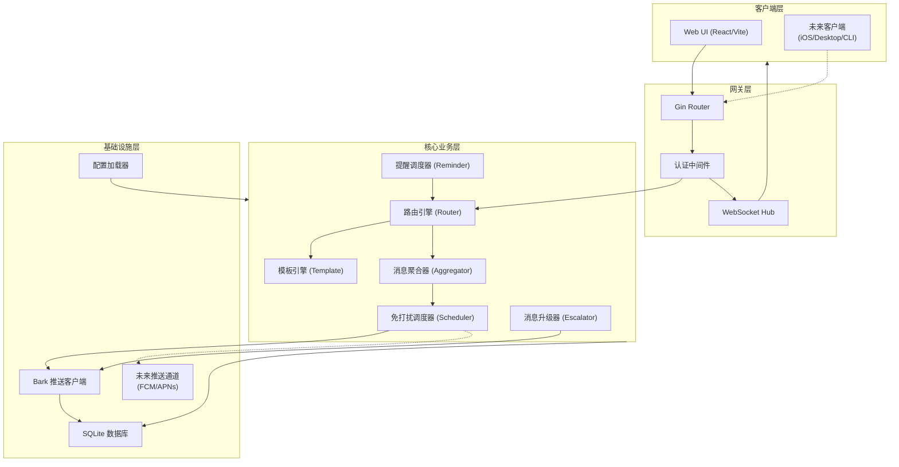
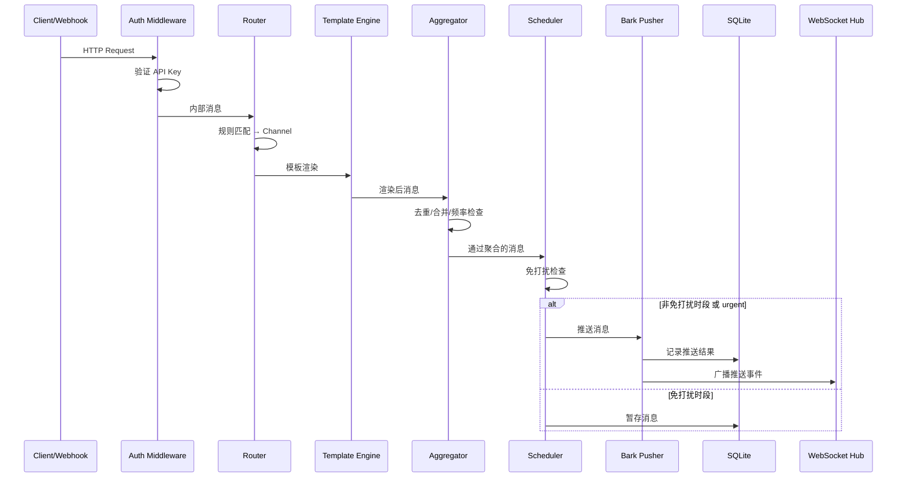

# Design Document: Overseer (bark-push-system)

## Overview

Overseer 是一个基于 Bark 的个人定制推送系统，核心理念是"听声辨事"——通过自定义声音区分不同类型的通知。系统采用 Go 语言开发，以单一二进制文件形式部署，内嵌 React/Vite 构建的 Web 前端。

### 当前阶段范围

- **后端**：Go + Gin 框架，SQLite 存储，YAML 配置
- **前端**：React + Vite，通过 `go:embed` 嵌入 Go 二进制
- **部署**：Docker 多阶段构建，scratch/distroless 基础镜像
- **推送通道**：仅 Bark (iOS)

### 架构扩展预留

- 移动端（React Native + Expo）、Desktop（Tauri）、CLI 暂不实现，但通过 RESTful API + WebSocket 协议预留接入点
- 推送通道通过 `Pusher` 接口抽象，后续可扩展 FCM/APNs

### 关键设计决策

| 决策 | 选择 | 理由 |
|------|------|------|
| Web 框架 | Gin | 高性能、社区活跃、中间件生态丰富 |
| 数据库 | SQLite (go-sqlite3) | 单文件部署、零运维、适合个人使用场景 |
| 配置格式 | YAML | 可读性强、支持复杂嵌套结构 |
| 定时任务 | robfig/cron + time.Timer | cron 处理周期任务，Timer 处理一次性精确触发 |
| 前端嵌入 | go:embed | 单二进制部署、无外部依赖 |
| WebSocket | gorilla/websocket | Go 生态最成熟的 WebSocket 库 |

## Architecture

### 高层架构图



### 消息处理流水线



### 目录结构

```
overseer/
├── cmd/
│   └── overseer/
│       └── main.go              # 入口
├── internal/
│   ├── config/
│   │   ├── config.go            # 配置结构定义
│   │   ├── loader.go            # YAML 加载与验证
│   │   └── validator.go         # 字段约束验证
│   ├── server/
│   │   ├── server.go            # HTTP 服务器启动
│   │   ├── middleware/
│   │   │   └── auth.go          # API Key 认证中间件
│   │   └── handler/
│   │       ├── webhook.go       # Webhook 处理器
│   │       ├── push.go          # 推送 API 处理器
│   │       ├── reminder.go      # 提醒 API 处理器
│   │       ├── history.go       # 历史查询处理器
│   │       ├── stats.go         # 统计 API 处理器
│   │       └── health.go        # 健康检查
│   ├── router/
│   │   ├── router.go            # 路由引擎
│   │   └── rule.go              # 规则匹配逻辑
│   ├── channel/
│   │   └── channel.go           # 频道管理
│   ├── aggregator/
│   │   ├── aggregator.go        # 聚合器主逻辑
│   │   ├── dedup.go             # 去重
│   │   ├── batch.go             # 批量合并
│   │   └── ratelimit.go         # 频率限制
│   ├── scheduler/
│   │   ├── dnd.go               # 免打扰调度
│   │   └── reminder.go          # 提醒调度
│   ├── escalator/
│   │   └── escalator.go         # 消息升级
│   ├── template/
│   │   └── engine.go            # 模板引擎
│   ├── pusher/
│   │   ├── pusher.go            # Pusher 接口定义
│   │   └── bark.go              # Bark 推送实现
│   ├── ws/
│   │   ├── hub.go               # WebSocket Hub
│   │   └── client.go            # WebSocket 客户端连接
│   ├── store/
│   │   ├── store.go             # 存储接口
│   │   ├── sqlite.go            # SQLite 实现
│   │   └── migrations/          # 数据库迁移
│   └── model/
│       ├── message.go           # 消息模型
│       ├── reminder.go          # 提醒模型
│       └── stats.go             # 统计模型
├── web/                          # React 前端源码
│   ├── src/
│   ├── package.json
│   └── vite.config.ts
├── embed.go                      # go:embed 前端静态资源
├── config.example.yaml
├── Dockerfile
├── docker-compose.yml
└── go.mod
```

## Components and Interfaces

### 1. 配置加载器 (Config Loader)

```go
// internal/config/config.go

type Config struct {
    Server    ServerConfig    `yaml:"server"`
    Bark      BarkConfig      `yaml:"bark"`
    Channels  []Channel       `yaml:"channels"`
    Rules     []Rule          `yaml:"rules"`
    DND       []DNDPeriod     `yaml:"dnd"`
    Templates []Template      `yaml:"templates"`
    Aggregator AggregatorConfig `yaml:"aggregator"`
    Escalation EscalationConfig `yaml:"escalation"`
}

type ServerConfig struct {
    Port   int    `yaml:"port" validate:"required,min=1,max=65535"`
    APIKey string `yaml:"api_key" validate:"required,min=16"`
}

type BarkConfig struct {
    ServerURL  string   `yaml:"server_url" validate:"required,url"`
    DeviceKey  string   `yaml:"device_key" validate:"required"`
    Timeout    int      `yaml:"timeout" default:"10"`  // 秒
    MaxRetries int      `yaml:"max_retries" default:"3"`
}

type Channel struct {
    Name       string   `yaml:"name" validate:"required"`
    Sound      string   `yaml:"sound"`
    Group      string   `yaml:"group"`
    Icon       string   `yaml:"icon" validate:"omitempty,url"`
    Level      string   `yaml:"level" validate:"oneof=active timeSensitive passive critical"`
    DeviceKeys []string `yaml:"device_keys" validate:"max=10"`
}

type Rule struct {
    Name     string `yaml:"name" validate:"required"`
    Source   string `yaml:"source"`
    Content  string `yaml:"content"`  // 正则表达式
    Channel  string `yaml:"channel" validate:"required"`
    Template string `yaml:"template"`
}

type DNDPeriod struct {
    Start string `yaml:"start" validate:"required"` // HH:MM
    End   string `yaml:"end" validate:"required"`   // HH:MM
    Days  string `yaml:"days" validate:"oneof=everyday weekday weekend"`
}

type Template struct {
    Name    string `yaml:"name" validate:"required,max=64,alphanumunicode"`
    Content string `yaml:"content" validate:"required"`
}

type AggregatorConfig struct {
    DedupeWindow    int `yaml:"dedupe_window" default:"300"`     // 秒
    BatchThreshold  int `yaml:"batch_threshold" default:"10"`
    RateWindow      int `yaml:"rate_window" default:"3600"`      // 秒
    RateLimit       int `yaml:"rate_limit" default:"30"`
    MaxPending      int `yaml:"max_pending" default:"100"`
}

type EscalationConfig struct {
    Enabled       bool   `yaml:"enabled"`
    WaitMinutes   int    `yaml:"wait_minutes" validate:"min=1,max=60"`
    MaxEscalations int   `yaml:"max_escalations" validate:"min=1,max=10"`
    Interval      string `yaml:"interval" validate:"oneof=fixed increasing"`
    IntervalMinutes int  `yaml:"interval_minutes" validate:"min=1,max=120"`
}
```

```go
// internal/config/loader.go

type Loader interface {
    Load(path string) (*Config, error)
    Validate(cfg *Config) error
}

type YAMLLoader struct{}

func (l *YAMLLoader) Load(path string) (*Config, error)
func (l *YAMLLoader) Validate(cfg *Config) error
```

### 2. 推送接口 (Pusher Interface)

```go
// internal/pusher/pusher.go

// Pusher 是推送通道的抽象接口，便于后续扩展 FCM/APNs
type Pusher interface {
    Push(ctx context.Context, req PushRequest) (*PushResponse, error)
    Name() string
}

type PushRequest struct {
    DeviceKey string
    Title     string
    Body      string
    Sound     string
    Group     string
    Icon      string
    Level     string
    URL       string
    Badge     int
}

type PushResponse struct {
    Success   bool
    MessageID string
    Error     string
}
```

```go
// internal/pusher/bark.go

// BarkPusher 实现 Pusher 接口，调用 Bark Server API
type BarkPusher struct {
    serverURL  string
    httpClient *http.Client
    maxRetries int
}

func NewBarkPusher(cfg BarkConfig) *BarkPusher
func (b *BarkPusher) Push(ctx context.Context, req PushRequest) (*PushResponse, error)
func (b *BarkPusher) Name() string  // 返回 "bark"
```

### 3. 路由引擎 (Router)

```go
// internal/router/router.go

type Router struct {
    rules    []CompiledRule
    channels map[string]*Channel
    fallback *Channel
}

type CompiledRule struct {
    Name           string
    SourceMatch    string          // 精确匹配
    ContentRegex   *regexp.Regexp  // 正则匹配
    TargetChannel  string
    TemplateName   string
}

func NewRouter(rules []Rule, channels []Channel) (*Router, error)
func (r *Router) Route(msg *Message) (*Channel, string)  // 返回匹配的频道和模板名
```

### 4. 消息聚合器 (Aggregator)

```go
// internal/aggregator/aggregator.go

type Aggregator struct {
    config     AggregatorConfig
    deduper    *Deduper
    rateLimiter *RateLimiter
    pending    map[string][]*Message  // channel -> pending messages
    mu         sync.Mutex
}

func NewAggregator(cfg AggregatorConfig) *Aggregator
func (a *Aggregator) Process(msg *Message) AggregateResult

type AggregateResult struct {
    Action   Action  // Pass, Dedupe, Batch, RateLimit
    Messages []*Message
    Summary  string
}

type Action int
const (
    ActionPass Action = iota
    ActionDedupe
    ActionBatch
    ActionRateLimit
)
```

### 5. 免打扰调度器 (Scheduler)

```go
// internal/scheduler/dnd.go

type DNDScheduler struct {
    periods    []CompiledDNDPeriod
    pending    []*Message
    maxPending int
    mu         sync.Mutex
    pushFunc   func(*Message) error
}

type CompiledDNDPeriod struct {
    Start time.Duration  // 从午夜开始的偏移
    End   time.Duration
    Days  DayMask
}

func NewDNDScheduler(periods []DNDPeriod, maxPending int) *DNDScheduler
func (s *DNDScheduler) ShouldDefer(msg *Message, now time.Time) bool
func (s *DNDScheduler) Enqueue(msg *Message)
func (s *DNDScheduler) FlushPending()  // DND 结束时调用
```

### 6. 消息升级器 (Escalator)

```go
// internal/escalator/escalator.go

type Escalator struct {
    config    EscalationConfig
    store     Store
    timers    map[string]*time.Timer  // messageID -> timer
    mu        sync.Mutex
    pushFunc  func(*Message) error
}

func NewEscalator(cfg EscalationConfig, store Store) *Escalator
func (e *Escalator) Track(msg *Message)
func (e *Escalator) Acknowledge(messageID string) error
func (e *Escalator) Stop()
```

### 7. 模板引擎 (Template Engine)

```go
// internal/template/engine.go

type Engine struct {
    templates map[string]*text_template.Template
}

func NewEngine(templates []config.Template) (*Engine, error)
func (e *Engine) Render(name string, msg *Message) (string, error)
```

### 8. WebSocket Hub

```go
// internal/ws/hub.go

type Hub struct {
    clients    map[*Client]bool
    broadcast  chan Event
    register   chan *Client
    unregister chan *Client
    maxConns   int
    mu         sync.RWMutex
}

type Event struct {
    Type    string      `json:"type"`    // "push", "reminder_change"
    Payload interface{} `json:"payload"`
}

func NewHub(maxConns int) *Hub
func (h *Hub) Run()
func (h *Hub) Broadcast(event Event)
func (h *Hub) ClientCount() int
```

### 9. 存储层 (Store)

```go
// internal/store/store.go

type Store interface {
    // 消息相关
    SaveMessage(msg *Message) error
    UpdateMessageStatus(id string, status PushStatus, failReason string) error
    QueryMessages(filter MessageFilter) (*PagedResult[Message], error)
    GetChannelStats(from, to time.Time) ([]ChannelStats, error)

    // 提醒相关
    CreateReminder(r *Reminder) error
    UpdateReminder(r *Reminder) error
    CancelReminder(id string) error
    ListReminders(filter ReminderFilter) ([]Reminder, error)
    GetActiveReminders() ([]Reminder, error)
    UpdateNextTrigger(id string, next time.Time) error

    // 生命周期
    Close() error
    Migrate() error
}
```

### 10. 提醒调度器 (Reminder Scheduler)

```go
// internal/scheduler/reminder.go

type ReminderScheduler struct {
    store     Store
    router    *Router
    timers    map[string]*time.Timer
    cronJobs  map[string]cron.EntryID
    cron      *cron.Cron
    mu        sync.Mutex
}

func NewReminderScheduler(store Store, router *Router) *ReminderScheduler
func (rs *ReminderScheduler) Start() error       // 加载所有活跃提醒
func (rs *ReminderScheduler) Schedule(r *Reminder) error
func (rs *ReminderScheduler) Cancel(id string) error
func (rs *ReminderScheduler) Stop()
```

## Data Models

### SQLite 数据库 Schema

```sql
-- 消息记录表
CREATE TABLE messages (
    id          TEXT PRIMARY KEY,          -- UUID
    source      TEXT NOT NULL,
    channel     TEXT NOT NULL,
    title       TEXT NOT NULL,
    body        TEXT NOT NULL,
    extra       TEXT,                      -- JSON 键值对
    status      TEXT NOT NULL DEFAULT 'pending',  -- pending/success/failed
    fail_reason TEXT,
    retry_count INTEGER DEFAULT 0,
    received_at DATETIME NOT NULL,
    pushed_at   DATETIME,
    created_at  DATETIME DEFAULT CURRENT_TIMESTAMP
);

CREATE INDEX idx_messages_channel ON messages(channel);
CREATE INDEX idx_messages_status ON messages(status);
CREATE INDEX idx_messages_received_at ON messages(received_at);

-- 提醒表
CREATE TABLE reminders (
    id          TEXT PRIMARY KEY,          -- UUID
    title       TEXT NOT NULL,
    body        TEXT,
    channel     TEXT NOT NULL DEFAULT 'default',
    trigger_at  DATETIME NOT NULL,
    repeat_type TEXT NOT NULL DEFAULT 'once',  -- once/daily/weekly/cron
    repeat_rule TEXT,                      -- 周几(0-6) 或 cron 表达式
    status      TEXT NOT NULL DEFAULT 'active', -- active/completed/cancelled
    next_trigger DATETIME,
    last_triggered DATETIME,
    fail_reason TEXT,
    created_at  DATETIME DEFAULT CURRENT_TIMESTAMP,
    updated_at  DATETIME DEFAULT CURRENT_TIMESTAMP
);

CREATE INDEX idx_reminders_status ON reminders(status);
CREATE INDEX idx_reminders_next_trigger ON reminders(next_trigger);

-- 推送设备记录（用于追踪多设备推送状态）
CREATE TABLE push_results (
    id          TEXT PRIMARY KEY,
    message_id  TEXT NOT NULL REFERENCES messages(id),
    device_key  TEXT NOT NULL,
    status      TEXT NOT NULL DEFAULT 'pending',
    fail_reason TEXT,
    retry_count INTEGER DEFAULT 0,
    pushed_at   DATETIME,
    created_at  DATETIME DEFAULT CURRENT_TIMESTAMP
);

CREATE INDEX idx_push_results_message ON push_results(message_id);
```

### 内部消息模型

```go
// internal/model/message.go

type Message struct {
    ID         string            `json:"id"`
    Source     string            `json:"source"`
    Channel    string            `json:"channel"`
    Title      string            `json:"title"`
    Body       string            `json:"body"`
    Extra      map[string]string `json:"extra,omitempty"`
    Status     PushStatus        `json:"status"`
    FailReason string            `json:"fail_reason,omitempty"`
    RetryCount int               `json:"retry_count"`
    ReceivedAt time.Time         `json:"received_at"`
    PushedAt   *time.Time        `json:"pushed_at,omitempty"`
}

type PushStatus string
const (
    StatusPending PushStatus = "pending"
    StatusSuccess PushStatus = "success"
    StatusFailed  PushStatus = "failed"
)

// internal/model/reminder.go

type Reminder struct {
    ID            string     `json:"id"`
    Title         string     `json:"title"`
    Body          string     `json:"body,omitempty"`
    Channel       string     `json:"channel"`
    TriggerAt     time.Time  `json:"trigger_at"`
    RepeatType    RepeatType `json:"repeat_type"`
    RepeatRule    string     `json:"repeat_rule,omitempty"`
    Status        string     `json:"status"`
    NextTrigger   *time.Time `json:"next_trigger,omitempty"`
    LastTriggered *time.Time `json:"last_triggered,omitempty"`
    CreatedAt     time.Time  `json:"created_at"`
    UpdatedAt     time.Time  `json:"updated_at"`
}

type RepeatType string
const (
    RepeatOnce   RepeatType = "once"
    RepeatDaily  RepeatType = "daily"
    RepeatWeekly RepeatType = "weekly"
    RepeatCron   RepeatType = "cron"
)
```

### API 请求/响应模型

```go
// 统一响应格式
type Response struct {
    Code    int         `json:"code"`
    Message string      `json:"message"`
    Data    interface{} `json:"data,omitempty"`
}

type PagedResponse struct {
    Total    int         `json:"total"`
    Page     int         `json:"page"`
    PageSize int         `json:"page_size"`
    Data     interface{} `json:"data"`
}

// Webhook 请求
type WebhookRequest struct {
    Title   string            `json:"title" binding:"required,min=1,max=200"`
    Body    string            `json:"body" binding:"required,min=1,max=4000"`
    Channel string            `json:"channel"`
    Extra   map[string]string `json:"extra"`
}

// 推送请求
type PushRequest struct {
    Title   string            `json:"title" binding:"required"`
    Body    string            `json:"body" binding:"required"`
    Channel string            `json:"channel"`
    Extra   map[string]string `json:"extra"`
}

// 提醒请求
type CreateReminderRequest struct {
    Title     string `json:"title" binding:"required,min=1,max=200"`
    Body      string `json:"body" binding:"max=4000"`
    TriggerAt string `json:"trigger_at" binding:"required"`  // RFC3339
    Channel   string `json:"channel"`
    Repeat    string `json:"repeat"`      // once/daily/weekly/cron
    RepeatRule string `json:"repeat_rule"` // 周几或cron表达式
}
```

### YAML 配置示例

```yaml
server:
  port: 8080
  api_key: "your-secure-api-key-here-min-16-chars"

bark:
  server_url: "https://api.day.app"
  device_key: "your-device-key"
  timeout: 10
  max_retries: 3

channels:
  - name: urgent
    sound: "alarm.caf"
    group: "紧急"
    level: critical
  - name: github
    sound: "glass.caf"
    group: "开发"
    icon: "https://github.githubassets.com/favicons/favicon.svg"
    level: active
  - name: monitor
    sound: "beacon.caf"
    group: "监控"
    level: timeSensitive
  - name: default
    sound: ""
    group: "default"
    level: active

rules:
  - name: github-ci-fail
    source: github
    content: "failed|error"
    channel: urgent
    template: github_alert
  - name: github-events
    source: github
    channel: github
    template: github_event
  - name: grafana-alerts
    source: grafana
    channel: monitor

templates:
  - name: github_alert
    content: "🚨 {{.source}}: {{.title}}"
  - name: github_event
    content: "📦 {{.title}}\n{{.body}}"

dnd:
  - start: "23:00"
    end: "07:30"
    days: everyday
  - start: "09:00"
    end: "12:00"
    days: weekend

aggregator:
  dedupe_window: 300
  batch_threshold: 10
  rate_window: 3600
  rate_limit: 30
  max_pending: 100

escalation:
  enabled: true
  wait_minutes: 5
  max_escalations: 3
  interval: increasing
  interval_minutes: 5
```

## Correctness Properties

*A property is a characteristic or behavior that should hold true across all valid executions of a system-essentially, a formal statement about what the system should do. Properties serve as the bridge between human-readable specifications and machine-verifiable correctness guarantees.*

### Property 1: 配置 Round-Trip 一致性

*For any* 通过验证的 Config 结构体，将其序列化为 YAML 字节流后再次解析，所得 Config 对象与原对象在所有字段值上逐一相等。

**Validates: Requirements 1.7, 1.5**

### Property 2: 必填字段缺失检测

*For any* 合法的 Config 结构体，移除任意一个必填字段（server.port、bark.server_url、bark.device_key、server.api_key）后进行验证，验证错误信息中必须包含被移除字段的名称。

**Validates: Requirements 1.4**

### Property 3: 字段约束违反检测

*For any* Config 结构体中的受约束字段（port 范围 1-65535、api_key 长度 ≥16、server_url 为合法 URL、正则表达式语法有效、Channel 名称唯一），当字段值违反约束时，验证必须失败并指明字段名称和约束要求。

**Validates: Requirements 1.6, 3.7, 2.2**

### Property 4: 路由引擎 First-Match 语义

*For any* 规则列表和入站消息，当消息匹配多条规则时，Router 必须返回按配置顺序排列的第一条匹配规则所指定的 Channel。匹配逻辑为：source 精确匹配 AND content 正则匹配（当两者同时定义时）。

**Validates: Requirements 3.1, 3.2, 3.3, 3.4, 3.5**

### Property 5: 路由引擎 Default 回退

*For any* 入站消息，当其不匹配任何已配置规则或指定了不存在的 Channel 时，Router 必须将其路由到 "default" 频道。

**Validates: Requirements 3.6, 2.7**

### Property 6: Channel 配置到 Bark 推送参数映射

*For any* 消息和其目标 Channel，生成的 Bark 推送请求必须包含该 Channel 配置的 sound、group、icon（非空时）和 level 参数；当 sound 为空时使用 Bark 默认值；当 icon 为空时不包含 icon 参数。

**Validates: Requirements 2.3, 2.4, 2.5, 2.6, 13.1**

### Property 7: API Key 认证

*For any* HTTP 请求（除 /health 端点外），当且仅当请求头 `X-API-Key` 的值与配置的 API key 完全一致时，请求才被允许通过；否则返回 HTTP 401。WebSocket 连接通过查询参数 `token` 进行同等验证。

**Validates: Requirements 7.2, 7.3, 11.1, 11.2, 16.4**

### Property 8: Webhook 请求验证与消息构造

*For any* 合法的 Webhook POST 请求（包含有效 JSON、title 1-200 字符、body 1-4000 字符），系统必须返回 HTTP 200 和消息 ID，且构造的内部消息的 source 等于 URL 路径参数、title 和 body 等于请求体对应字段。对于不合法请求（非 JSON、缺少必填字段、字段超长），系统必须返回 HTTP 400。

**Validates: Requirements 7.4, 7.5, 7.6, 7.7**

### Property 9: 消息去重

*For any* Channel 和时间窗口内，当收到 N 条内容完全相同（title + body 逐字符匹配）的消息时，Aggregator 仅推送第一条，且推送内容中附带重复计数 N。

**Validates: Requirements 4.1**

### Property 10: 消息批量合并

*For any* Channel 和时间窗口内，当收到超过配置阈值的不同消息时，Aggregator 将其合并为一条摘要推送，摘要包含消息总数和每条消息的 title。

**Validates: Requirements 4.2**

### Property 11: 频率限制

*For any* Channel，当其在当前时间窗口内的推送次数达到配置上限时，后续消息被暂存；下一个时间窗口开始时，暂存消息按接收顺序批量推送。

**Validates: Requirements 4.3**

### Property 12: Critical 消息绕过聚合

*For any* 优先级为 "critical" 的 Channel 消息，无论当前去重、合并或频率限制状态如何，该消息必须直接推送，不受任何聚合规则约束。

**Validates: Requirements 4.4**

### Property 13: 免打扰按优先级分流

*For any* 时间点处于 DND 时段内时，优先级非 "urgent" 的消息必须被暂存，优先级为 "urgent" 的消息必须直接推送。

**Validates: Requirements 5.2, 5.3**

### Property 14: 免打扰结束后按时间顺序释放

*For any* DND 时段结束时暂存的消息集合，释放顺序必须严格按照消息的原始接收时间从早到晚排列。

**Validates: Requirements 5.4**

### Property 15: 重叠 DND 时段合并

*For any* 存在时间重叠的多个 DND 时段，系统必须将其视为连续静默期，仅在所有重叠时段均结束后才释放暂存消息。

**Validates: Requirements 5.5**

### Property 16: 超时未确认触发升级

*For any* 标记为需要确认的消息，当超过配置等待时间未收到确认时，系统必须将其升级到下一级 Channel 重新推送，推送内容包含升级次数和原始发送时间。

**Validates: Requirements 6.1, 6.2**

### Property 17: 升级次数上限

*For any* 已达到最大升级次数的消息，系统必须停止后续升级，执行一次标注"已达上限"的最终推送。

**Validates: Requirements 6.3**

### Property 18: 确认取消升级

*For any* 收到确认回调的消息，系统必须取消该消息的所有待执行升级计划，后续不再触发任何升级推送。

**Validates: Requirements 6.4**

### Property 19: 模板渲染与回退

*For any* 消息和关联模板，当模板存在且渲染成功（结果非空）时使用渲染结果；当模板不存在、渲染出错或结果为空时，回退使用原始消息内容。模板可访问 source、title、body、timestamp、extra 字段。

**Validates: Requirements 8.2, 8.3, 8.4, 8.5, 8.6**

### Property 20: 多设备独立推送

*For any* 配置了多个 device_key 的 Channel，系统必须向每个设备分别发送推送请求；单个设备推送失败不影响其余设备的推送执行。未配置 device_key 的 Channel 使用全局默认 device_key。

**Validates: Requirements 9.2, 9.3**

### Property 21: 指数退避重试

*For any* Bark 推送失败（HTTP 非 200 或响应 code 非 200），系统按 1s、2s、4s 间隔重试最多 3 次；所有重试失败后标记为失败并记录最后一次错误详情。

**Validates: Requirements 13.2, 13.3**

### Property 22: 消息持久化生命周期

*For any* 经过 Router 处理的消息，必须被持久化到数据库，包含 source、channel、title、body、received_at、status 字段。推送成功时更新 status 为 success 并记录 pushed_at；推送失败时更新 status 为 failed 并记录 fail_reason 和 retry_count。

**Validates: Requirements 10.1, 10.4, 13.5**

### Property 23: 查询 API 分页与过滤

*For any* 消息集合和查询条件（时间范围、Channel、状态），API 返回的结果必须是满足所有过滤条件的子集，按时间倒序排列，分页信息（total、page、page_size）与实际数据一致。

**Validates: Requirements 10.2, 10.5, 15.5**

### Property 24: 提醒调度正确性

*For any* 提醒及其重复规则（once/daily/weekly/cron），当到达触发时间时系统必须生成推送；对于重复提醒，触发后必须根据规则正确计算下一次触发时间（daily +24h、weekly +7d 到指定星期几、cron 按表达式）。

**Validates: Requirements 14.2, 14.3, 14.4**

### Property 25: 提醒持久化与恢复

*For any* 活跃状态的提醒，服务重启后从数据库加载并重新调度，不丢失且继续按计划触发。

**Validates: Requirements 14.9**

### Property 26: 统一 API 响应格式

*For any* API 端点的响应，成功时格式为 `{"code": 200, "message": "success", "data": {...}}`，错误时使用对应 HTTP 状态码和错误描述，格式一致。

**Validates: Requirements 15.4**

### Property 27: WebSocket 事件广播

*For any* 成功推送的消息或提醒状态变更（创建/修改/取消），系统必须通过 WebSocket 向所有已认证的连接客户端广播对应事件，事件包含正确的类型和负载数据。

**Validates: Requirements 16.2, 16.3**

### Property 28: 统计数据准确性

*For any* 时间范围内的消息集合，统计 API 返回的每个 Channel 的推送总数、成功数、失败数必须与数据库中实际记录一致，百分比计算正确。

**Validates: Requirements 10.3**

## Error Handling

### 错误分类与处理策略

| 错误类别 | 示例 | 处理策略 |
|----------|------|----------|
| 配置错误 | YAML 语法错误、必填字段缺失、约束违反 | 启动时检测，输出明确错误信息，终止进程 |
| 请求验证错误 | 无效 JSON、缺少必填字段、字段超长 | 返回 HTTP 400 + 错误详情 |
| 认证错误 | 无效/缺失 API Key | 返回 HTTP 401 |
| 推送失败 | Bark 服务不可达、超时、返回错误 | 指数退避重试 → 标记失败 → 记录详情 |
| 模板渲染错误 | 引用不存在字段、类型不匹配 | 回退原始内容 + 警告日志 |
| 数据库错误 | SQLite 写入失败、磁盘满 | 记录错误日志，返回 HTTP 500 |
| WebSocket 错误 | 连接断开、发送失败 | 清理连接资源，从 Hub 移除 |

### 错误响应格式

```json
{
  "code": 400,
  "message": "validation error: field 'title' is required",
  "data": null
}
```

### 重试策略详情

```go
// Bark 推送重试
type RetryConfig struct {
    MaxRetries     int           // 默认 3
    InitialBackoff time.Duration // 1 秒
    BackoffFactor  float64       // 2.0 (指数退避)
    MaxBackoff     time.Duration // 4 秒
    Timeout        time.Duration // 10 秒/请求
}

// 提醒推送重试
// 失败后 1 分钟重试一次，仍失败则标记为触发失败
```

### 优雅关闭

```go
// 收到 SIGTERM/SIGINT 时：
// 1. 停止接受新请求
// 2. 等待进行中的推送完成（最多 30 秒）
// 3. 关闭 WebSocket 连接
// 4. 停止所有定时器（Escalator、Reminder）
// 5. 关闭数据库连接
// 6. 退出
```

## Testing Strategy

### 测试框架选择

- **单元测试**：Go 标准 `testing` 包
- **属性测试**：[`pgregory.net/rapid`](https://github.com/flyingmutant/rapid)（Go 生态最活跃的 PBT 库）
- **HTTP 测试**：`net/http/httptest`
- **Mock**：`github.com/stretchr/testify/mock`
- **WebSocket 测试**：`github.com/gorilla/websocket` 客户端

### 属性测试配置

- 每个属性测试最少运行 **100 次迭代**
- 每个测试标注对应的设计属性编号
- 标签格式：`// Feature: bark-push-system, Property N: <property_text>`

### 测试层次

| 层次 | 覆盖范围 | 工具 |
|------|----------|------|
| 属性测试 | Config round-trip、Router 匹配、Aggregator 逻辑、Scheduler 逻辑、Template 渲染 | rapid |
| 单元测试 | 边界条件、错误路径、具体示例 | testing |
| 集成测试 | HTTP API 端到端、WebSocket 通信、数据库读写 | httptest + SQLite in-memory |
| 冒烟测试 | Docker 构建、健康检查、启动时间 | Docker + curl |

### 属性测试重点

1. **Config 模块**：round-trip、验证逻辑（Properties 1-3）
2. **Router 模块**：匹配语义、优先级、回退（Properties 4-5）
3. **Aggregator 模块**：去重、合并、频率限制、critical 绕过（Properties 9-12）
4. **Scheduler 模块**：DND 分流、释放顺序、重叠处理（Properties 13-15）
5. **Escalator 模块**：超时升级、上限停止、确认取消（Properties 16-18）
6. **Template 模块**：渲染与回退（Property 19）
7. **Pusher 模块**：参数映射、多设备、重试（Properties 6, 20-21）
8. **Store 模块**：持久化生命周期、查询过滤（Properties 22-23）
9. **Reminder 模块**：调度正确性、持久化恢复（Properties 24-25）

### 单元测试重点

- 配置文件不存在/无权限的错误消息格式
- YAML 语法错误的行号报告
- /health 端点免认证
- WebSocket 连接数上限（20）
- WebSocket 空闲超时（60 秒）
- 提醒触发时间不能为过去时间
- 查询时间范围不超过 90 天
- 测试推送不记录历史

### 集成测试重点

- 完整消息流水线：Webhook → Router → Aggregator → Scheduler → Pusher → DB
- 数据库自动创建和迁移
- 服务启动时间 < 5 秒
- Docker 镜像大小 < 50MB

