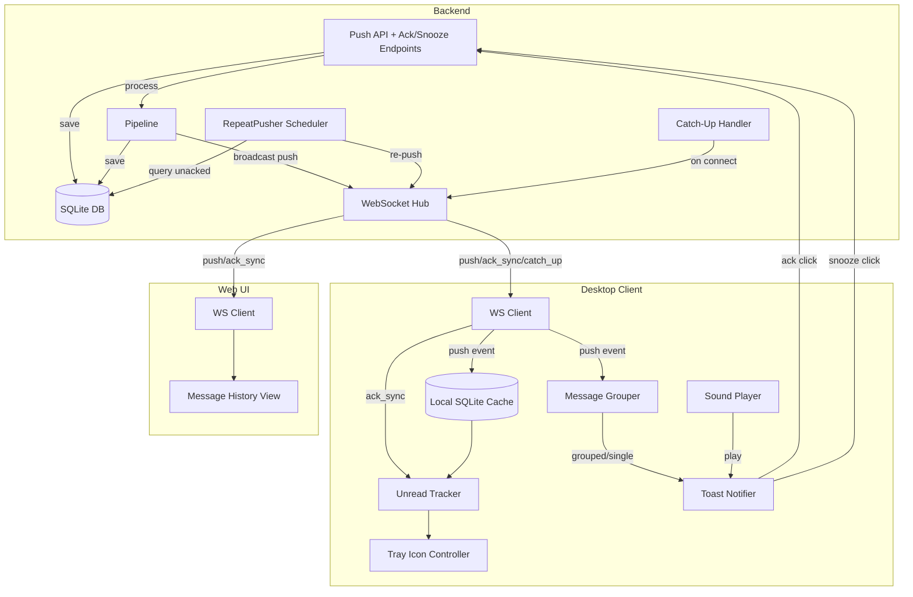
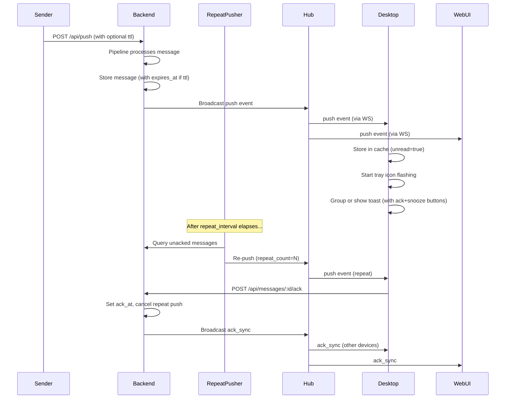

# Design Document: Notification Lifecycle

## Overview

This design introduces a full notification lifecycle to the Overseer push notification system. The current architecture is fire-and-forget: messages flow through the pipeline (Router → Template → Aggregator → DND → Pusher → DB → WebSocket) and are never revisited. This feature adds state tracking, acknowledgment, repeat delivery, snooze, offline catch-up, cross-device sync, message grouping, custom sounds, and TTL expiration.

The design is split across three system boundaries:
1. **Backend** (Go/Gin server): New DB columns, API endpoints, repeat pusher scheduler, catch-up logic
2. **Desktop Client** (Go system tray app): Unread tracking, icon flashing, toast action buttons, message grouping, sound playback
3. **Web UI** (React/TypeScript): Ack status display in message history

The new **RepeatPusher** component generalizes the existing `internal/escalator` package. The escalator currently handles critical-level messages only with in-memory tracking. The RepeatPusher is DB-backed, configurable per-channel, and supports snooze/TTL. Once stable, the escalator can be deprecated.

## Architecture



### Component Interaction Flow



## Components and Interfaces

### Backend Components

#### 1. Ack/Snooze API Handlers (`internal/server/handler/lifecycle.go`)

```go
// LifecycleHandler handles acknowledgment and snooze endpoints.
type LifecycleHandler struct {
    store store.Store
    hub   *ws.Hub
    rp    *repeatpusher.RepeatPusher
}

// POST /api/messages/:id/ack
func (h *LifecycleHandler) HandleAck(c *gin.Context)

// POST /api/messages/:id/snooze
// Body: { "duration": "1h" | "2h" | "4h" | "tomorrow_9am" }
func (h *LifecycleHandler) HandleSnooze(c *gin.Context)
```

#### 2. RepeatPusher Scheduler (`internal/repeatpusher/repeatpusher.go`)

Modeled after `internal/scheduler/reminder.go` — uses `time.AfterFunc` timers backed by DB state.

```go
// RepeatPusher manages periodic re-delivery of unacknowledged messages.
type RepeatPusher struct {
    store    store.Store
    hub      *ws.Hub
    timers   map[string]*time.Timer // messageID -> timer
    mu       sync.Mutex
    stopCh   chan struct{}
    nowFunc  func() time.Time
}

// Start loads all eligible unacked messages from DB and schedules them.
func (rp *RepeatPusher) Start() error

// Schedule begins tracking a message for repeat push.
func (rp *RepeatPusher) Schedule(msg *model.Message, interval time.Duration, maxRepeats int) error

// Cancel stops repeat push for a message (called on ack).
func (rp *RepeatPusher) Cancel(messageID string)

// ScheduleSnooze defers a message's next push to snooze_until.
func (rp *RepeatPusher) ScheduleSnooze(messageID string, until time.Time)

// Stop gracefully shuts down all timers.
func (rp *RepeatPusher) Stop()
```

#### 3. Catch-Up Handler (`internal/server/handler/ws.go` extension)

On WebSocket connection establishment for desktop clients, query and deliver missed messages:

```go
// performCatchUp sends missed messages to a newly connected desktop client.
func (h *WSHandler) performCatchUp(client *ws.Client, deviceKey string)
```

#### 4. Extended Store Interface (`internal/store/store.go`)

New methods:

```go
// Lifecycle operations
AckMessage(id string, ackAt time.Time) error
SnoozeMessage(id string, snoozeUntil time.Time) error
GetMessage(id string) (*model.Message, error)
GetUnackedMessages(channelNames []string) ([]model.Message, error)
GetCatchUpMessages(lastSeen time.Time, maxAge time.Duration) ([]model.Message, error)
UpdateRepeatCount(id string, count int) error
ExpireMessage(id string) error
UpdateDeviceLastSeen(deviceKey string, lastSeen time.Time) error
GetDeviceLastSeen(deviceKey string) (time.Time, error)
```

### Desktop Client Components

#### 5. Enhanced Cache (`cmd/desktop/internal/cache/cache.go`)

Add `unread` boolean column and `expired` tracking:

```go
// Extended Entry with lifecycle fields
type Entry struct {
    ID         string
    Title      string
    Body       string
    URL        string
    Channel    string
    Source     string
    ReceivedAt time.Time
    Unread     bool       // NEW
    AckedAt    *time.Time // NEW
    ExpiresAt  *time.Time // NEW
}

func (c *Cache) MarkRead(id string) error
func (c *Cache) MarkAllRead() error
func (c *Cache) UnreadCount() (int, error)
func (c *Cache) MarkAckSynced(id string) error
func (c *Cache) GetUnexpiredUnread() ([]Entry, error)
```

#### 6. Unread Tracker (`cmd/desktop/internal/unread/tracker.go`)

Coordinates between cache state and tray icon:

```go
type Tracker struct {
    cache    *cache.Cache
    onUpdate func(unreadCount int) // callback to tray controller
}

func (t *Tracker) OnPush(id string)
func (t *Tracker) OnRead(id string)
func (t *Tracker) OnReadAll()
func (t *Tracker) OnAckSync(id string)
func (t *Tracker) OnExpired(id string)
func (t *Tracker) ShouldFlash() bool
```

#### 7. Message Grouper (`cmd/desktop/internal/grouper/grouper.go`)

Batches rapid notifications from the same source:

```go
type Grouper struct {
    window   time.Duration // 30 seconds
    pending  map[string]*pendingGroup // source -> group
    mu       sync.Mutex
    showFunc func(title, body, url string) // callback to notifier
}

type pendingGroup struct {
    source   string
    messages []PushEvent
    timer    *time.Timer
}

// Ingest processes an incoming push event, either grouping or showing immediately.
func (g *Grouper) Ingest(event PushEvent)
```

#### 8. Sound Player (`cmd/desktop/internal/sound/player.go`)

```go
type Player struct {
    cacheDir    string
    soundCache  map[string]string // channel -> local file path
    mu          sync.RWMutex
}

func (p *Player) Play(channel string, level string) error
func (p *Player) CacheSound(channel string, url string) error
```

### Web UI Components

#### 9. Ack Status Display (`web/src/components/MessageAckBadge.tsx`)

```tsx
interface MessageAckBadgeProps {
    ackAt: string | null;
}

// Displays "已确认 HH:mm" or "未确认" badge
export function MessageAckBadge({ ackAt }: MessageAckBadgeProps): JSX.Element
```

### WebSocket Event Types

Extended event envelope:

```json
// Existing
{ "type": "push", "payload": { ... } }

// New events
{ "type": "ack_sync", "payload": { "message_id": "xxx" } }
{ "type": "catch_up", "payload": { "messages": [...] } }
```

### API Endpoints

| Method | Path | Description |
|--------|------|-------------|
| POST | `/api/messages/:id/ack` | Acknowledge a message |
| POST | `/api/messages/:id/snooze` | Snooze a message |

**POST /api/messages/:id/ack**
- Request: empty body
- Response 200: `{ "code": 200, "message": "ok" }`
- Response 404: `{ "code": 404, "message": "message not found" }`

**POST /api/messages/:id/snooze**
- Request: `{ "duration": "1h" | "2h" | "4h" | "tomorrow_9am" }`
- Response 200: `{ "code": 200, "message": "ok", "snooze_until": "2024-01-01T10:00:00Z" }`
- Response 404: `{ "code": 404, "message": "message not found" }`
- Response 400: `{ "code": 400, "message": "invalid duration" }`

## Data Models

### Backend: Extended Message Model

```go
type Message struct {
    // ... existing fields ...
    ID          string            `json:"id"`
    Source      string            `json:"source"`
    Channel     string            `json:"channel"`
    Title       string            `json:"title"`
    Body        string            `json:"body"`
    Extra       map[string]string `json:"extra,omitempty"`
    Status      PushStatus        `json:"status"`
    FailReason  string            `json:"fail_reason,omitempty"`
    RetryCount  int               `json:"retry_count"`
    ReceivedAt  time.Time         `json:"received_at"`
    PushedAt    *time.Time        `json:"pushed_at,omitempty"`
    Sound       string            `json:"sound,omitempty"`
    Icon        string            `json:"icon,omitempty"`
    Group       string            `json:"group,omitempty"`
    Level       string            `json:"level,omitempty"`
    URL         string            `json:"url,omitempty"`

    // NEW lifecycle fields
    AckAt       *time.Time        `json:"ack_at,omitempty"`
    SnoozeUntil *time.Time        `json:"snooze_until,omitempty"`
    ExpiresAt   *time.Time        `json:"expires_at,omitempty"`
    RepeatCount int               `json:"repeat_count"`
}
```

New `PushStatus` values:
```go
const (
    StatusExpiredUnacked PushStatus = "expired_unacked"
    StatusExpired        PushStatus = "expired"
)
```

### Backend: Extended Channel Config

```yaml
channels:
  - name: alerts
    sound: alarm
    level: critical
    # NEW lifecycle fields
    require_ack: true
    repeat_interval: "5m"
    max_repeats: 10
    sound_file: "/path/to/custom.wav"
```

```go
// Extended Channel config struct
type Channel struct {
    Name           string   `yaml:"name"`
    Sound          string   `yaml:"sound"`
    Group          string   `yaml:"group"`
    Icon           string   `yaml:"icon"`
    Level          string   `yaml:"level"`
    DeviceKeys     []string `yaml:"device_keys"`
    // NEW
    RequireAck     bool     `yaml:"require_ack"`
    RepeatInterval string   `yaml:"repeat_interval"`
    MaxRepeats     int      `yaml:"max_repeats"`
    SoundFile      string   `yaml:"sound_file"`
}
```

### Backend: DB Schema Changes (SQLite migration)

```sql
-- Add lifecycle columns to messages table
ALTER TABLE messages ADD COLUMN ack_at DATETIME;
ALTER TABLE messages ADD COLUMN snooze_until DATETIME;
ALTER TABLE messages ADD COLUMN expires_at DATETIME;
ALTER TABLE messages ADD COLUMN repeat_count INTEGER DEFAULT 0;

-- Add last_seen tracking to devices table
ALTER TABLE devices ADD COLUMN last_seen DATETIME;

-- Index for repeat pusher queries
CREATE INDEX idx_messages_unacked ON messages(channel, ack_at, expires_at, status)
    WHERE ack_at IS NULL AND status = 'success';

-- Index for catch-up queries
CREATE INDEX idx_messages_catchup ON messages(received_at, ack_at)
    WHERE ack_at IS NULL;
```

### Desktop Client: Extended Cache Schema

```sql
-- Add lifecycle columns to notifications table
ALTER TABLE notifications ADD COLUMN unread INTEGER DEFAULT 1;
ALTER TABLE notifications ADD COLUMN acked_at DATETIME;
ALTER TABLE notifications ADD COLUMN expires_at DATETIME;
```

### Push Event Payload (Extended)

```json
{
    "type": "push",
    "payload": {
        "id": "msg-uuid",
        "source": "monitoring",
        "channel": "alerts",
        "title": "CPU High",
        "body": "Server cpu at 95%",
        "url": "",
        "icon": "",
        "level": "critical",
        "status": "success",
        "time": "2024-01-01T12:00:00Z",
        "repeat_count": 0,
        "expires_at": "2024-01-02T12:00:00Z"
    }
}
```

## Correctness Properties

*A property is a characteristic or behavior that should hold true across all valid executions of a system — essentially, a formal statement about what the system should do. Properties serve as the bridge between human-readable specifications and machine-verifiable correctness guarantees.*

### Property 1: Unread state persistence round-trip

*For any* set of notifications stored in the local cache with unread status, closing and reopening the cache database SHALL preserve the exact unread/read state of every entry.

**Validates: Requirements 1.4**

### Property 2: Tray icon flashing reflects unread count

*For any* state of the local notification cache, the tray icon SHALL be flashing if and only if the count of unexpired unread notifications is greater than zero.

**Validates: Requirements 2.1, 2.2, 11.3**

### Property 3: Exponential backoff retry

*For any* sequence of N consecutive network failures (where 1 ≤ N ≤ 3) on an ack or snooze POST request, the client SHALL retry with delays following exponential backoff (delay_i = base * 2^(i-1)), and SHALL stop retrying after 3 attempts.

**Validates: Requirements 3.3, 8.3**

### Property 4: Acknowledgment sets timestamp

*For any* valid message ID referencing an unacknowledged message, calling POST /api/messages/:id/ack SHALL result in the message having a non-null ack_at timestamp equal to the current time (within clock tolerance).

**Validates: Requirements 4.1**

### Property 5: Acknowledgment is idempotent

*For any* message that has already been acknowledged (ack_at is non-null), calling POST /api/messages/:id/ack again SHALL return HTTP 200 and the ack_at value SHALL remain unchanged.

**Validates: Requirements 4.4**

### Property 6: Acknowledged messages excluded from repeat push

*For any* message with a non-null ack_at value, the RepeatPusher SHALL never schedule or execute a repeat push for that message, regardless of channel configuration or repeat_count.

**Validates: Requirements 4.2, 7.3**

### Property 7: Ack status display correctness

*For any* message displayed in the Web UI message history, the UI SHALL show the ack_at timestamp formatted as "已确认 HH:mm" if ack_at is non-null, or "未确认" if ack_at is null.

**Validates: Requirements 5.1, 5.2**

### Property 8: Channel repeat_interval validation

*For any* string value provided as repeat_interval in channel configuration, the validator SHALL accept it if and only if it parses to a duration between 1 minute and 24 hours (inclusive).

**Validates: Requirements 6.3**

### Property 9: Channel max_repeats validation

*For any* integer value provided as max_repeats in channel configuration, the validator SHALL accept it if and only if it is between 1 and 100 (inclusive).

**Validates: Requirements 6.4**

### Property 10: Repeat push fires after interval

*For any* unacknowledged, non-snoozed, non-expired message on a require_ack channel, the RepeatPusher SHALL schedule a re-push exactly after the configured repeat_interval elapses from the last push time.

**Validates: Requirements 7.1**

### Property 11: Repeat push stops at max_repeats

*For any* message whose repeat_count equals the channel's max_repeats, the RepeatPusher SHALL mark the message as "expired_unacked" and SHALL not schedule any further repeat pushes.

**Validates: Requirements 7.2**

### Property 12: Repeat push resumes after restart

*For any* set of unacknowledged messages on require_ack channels with repeat_count < max_repeats and no expiration, after a RepeatPusher restart (calling Start()), all such messages SHALL be re-scheduled for repeat push.

**Validates: Requirements 7.5**

### Property 13: Snooze computes snooze_until correctly

*For any* valid snooze duration ("1h", "2h", "4h") applied to a message, the recorded snooze_until SHALL equal the current time plus the parsed duration.

**Validates: Requirements 9.1**

### Property 14: Snoozed messages excluded from repeat push

*For any* message with snooze_until in the future (current time < snooze_until), the RepeatPusher SHALL not schedule or execute a repeat push for that message.

**Validates: Requirements 9.2**

### Property 15: Snooze expiry triggers re-push

*For any* snoozed message, when the current time reaches or exceeds snooze_until, the RepeatPusher SHALL re-push the message via WebSocket within one scheduler tick.

**Validates: Requirements 9.3**

### Property 16: Catch-up returns messages after last_seen

*For any* device with a recorded last_seen timestamp, the catch-up query SHALL return exactly those unacknowledged messages with received_at > last_seen (subject to the 7-day limit).

**Validates: Requirements 10.2**

### Property 17: Catch-up messages in chronological order

*For any* set of catch-up messages delivered to a reconnecting client, the messages SHALL be ordered by received_at ascending (oldest first).

**Validates: Requirements 10.3**

### Property 18: Catch-up limited to 7 days

*For any* catch-up query, messages with received_at older than 7 days before the current time SHALL be excluded from the result set, regardless of their acknowledgment status.

**Validates: Requirements 10.4**

### Property 19: Ack_sync marks message as read

*For any* "ack_sync" WebSocket event received by a Desktop_Client containing a valid message ID present in the local cache, that message SHALL be marked as read (unread=false) in the local cache.

**Validates: Requirements 11.2**

### Property 20: Message grouping by source within time window

*For any* sequence of N push events (N ≥ 2) from the same source arriving within a 30-second window, the Desktop_Client SHALL produce exactly one summary toast notification instead of N individual notifications.

**Validates: Requirements 12.1, 12.4**

### Property 21: Grouped notification format

*For any* grouped notification with source S and count C, the toast title SHALL be formatted as "[{S}] {C} new notifications".

**Validates: Requirements 12.2**

### Property 22: Sound fallback to level-based default

*For any* notification arriving on a channel without a configured sound_file, the Desktop_Client SHALL select the sound based on the message level: "critical" → LoopingAlarm, "timeSensitive" → Reminder, "passive" → Silent, default → Default.

**Validates: Requirements 13.4**

### Property 23: TTL computes expires_at correctly

*For any* message with a valid ttl field, the stored expires_at SHALL equal received_at + parsed(ttl).

**Validates: Requirements 14.2**

### Property 24: Expired messages excluded from repeat push and unread count

*For any* message whose expires_at is in the past (current time > expires_at), the RepeatPusher SHALL not schedule repeat pushes AND the Desktop_Client SHALL exclude it from the unread count.

**Validates: Requirements 14.3, 14.4**

### Property 25: TTL validation

*For any* string value provided as ttl in the push API request, the validator SHALL accept it if and only if it parses to a duration between 1 minute and 30 days (inclusive).

**Validates: Requirements 14.5**

## Error Handling

### Backend

| Scenario | Handling |
|----------|----------|
| Ack for non-existent message | Return HTTP 404 with `{"code": 404, "message": "message not found"}` |
| Ack for already-acked message | Return HTTP 200 (idempotent), no modification |
| Snooze for non-existent message | Return HTTP 404 |
| Snooze with invalid duration | Return HTTP 400 with `{"code": 400, "message": "invalid duration"}` |
| TTL with invalid duration | Return HTTP 400, reject the push request |
| RepeatPusher DB query failure | Log error, retry on next tick (1 minute) |
| RepeatPusher WebSocket push failure | Increment retry, reschedule at next interval |
| Catch-up query failure | Log error, skip catch-up (client will get future messages normally) |
| Channel config with invalid repeat_interval | Reject config on load/update, log validation error |

### Desktop Client

| Scenario | Handling |
|----------|----------|
| Ack POST network failure | Exponential backoff retry (1s, 2s, 4s), max 3 attempts |
| Snooze POST network failure | Same retry strategy as ack |
| Cache DB corruption | Delete and recreate cache DB, log warning |
| Sound file download failure | Log warning, fall back to level-based default sound |
| WebSocket disconnect during ack | Queue ack locally, retry on reconnect |
| Grouped notification timer race | Use mutex to protect pending groups map |

### Web UI

| Scenario | Handling |
|----------|----------|
| WebSocket disconnect | Show "disconnected" indicator, auto-reconnect |
| Ack_sync for unknown message | Ignore silently (message may have been pruned from view) |

## Testing Strategy

### Property-Based Testing

This feature is well-suited for property-based testing. The core logic involves state machines (message lifecycle states), input validation (duration parsing, bounds checking), and invariants (ack stops repeat push, expiry excludes from unread).

**Library**: [rapid](https://github.com/flyingmutant/rapid) (Go property-based testing library)

**Configuration**: Minimum 100 iterations per property test.

**Tag format**: `// Feature: notification-lifecycle, Property {N}: {title}`

Each correctness property (1–25) maps to a single property-based test. Tests will be organized in:
- `internal/repeatpusher/repeatpusher_prop_test.go` — Properties 6, 10, 11, 12, 14, 15, 24
- `internal/server/handler/lifecycle_prop_test.go` — Properties 4, 5
- `internal/config/validator_prop_test.go` — Properties 8, 9, 25
- `internal/store/lifecycle_prop_test.go` — Properties 16, 17, 18, 23
- `cmd/desktop/internal/cache/cache_prop_test.go` — Properties 1, 19
- `cmd/desktop/internal/unread/tracker_prop_test.go` — Property 2
- `cmd/desktop/internal/grouper/grouper_prop_test.go` — Properties 20, 21
- `cmd/desktop/internal/notifier/retry_prop_test.go` — Property 3

### Unit Tests (Example-Based)

- Toast notification includes ack and snooze buttons (Req 3.1, 8.1)
- Ack button triggers correct POST endpoint (Req 3.2)
- Snooze button sends POST with duration="1h" (Req 8.2)
- Snooze duration "tomorrow_9am" computes correct timestamp (Req 9.5)
- Channel config with sound_file is accepted (Req 13.1)
- Push API accepts optional ttl field (Req 14.1)
- Message without ttl has null expires_at (Req 14.6)
- Grouped toast click opens Web UI with source filter (Req 12.3)

### Integration Tests

- WebSocket ack_sync broadcast reaches all connected clients (Req 11.1)
- Sound file download and caching on connect (Req 13.2)
- Real-time ack status update in Web UI via WebSocket (Req 5.3)
- Full catch-up flow: disconnect → messages arrive → reconnect → receive catch-up (Req 10.1–10.4)
- RepeatPusher end-to-end: message → wait interval → re-push arrives at desktop (Req 7.1)

### Smoke Tests

- Backend starts with new DB migration applied
- Desktop client starts with extended cache schema
- Channel config with lifecycle fields loads without error
